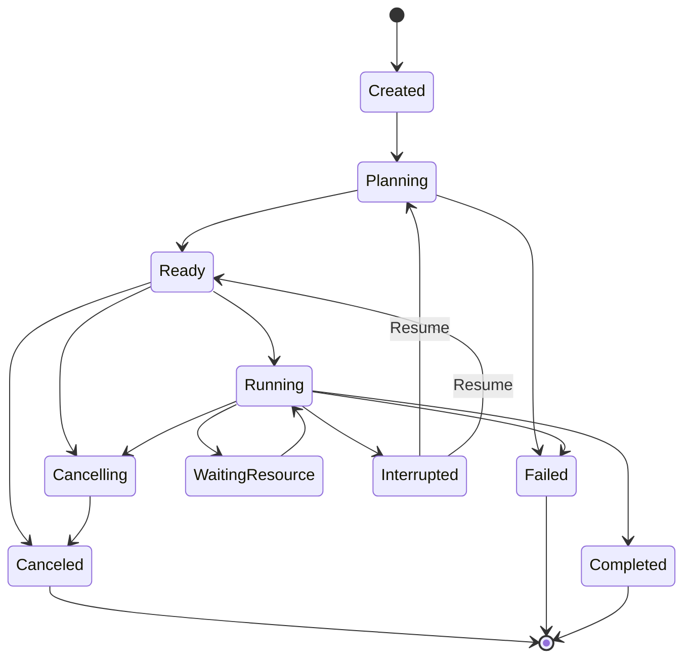

# Workflow Engine 2.0 Developer & Integration Guide

## 1. 概述 (Overview)

Workflow Engine 2.0 是 `exp-rs` 面向自动化空间分析、多智能体协同（Pi / MCP / Agent Copilot）与大规模遥感处理图（DAG）设计的核心工作流引擎。相比 1.x 版本，2.0 版本提供了 10 状态生命周期、RFC 8785 确定性缓存与指纹计算、原子 Checkpoint 崩溃恢复机制，以及多生命周期的中间产物垃圾回收（Artifact GC）。

---

## 2. 状态机模型 (10-State Lifecycle Machine)

### 2.1 状态枚举定义 (`WorkflowRunState`)

```cpp
namespace sicnu::workflow {
enum class WorkflowRunState {
    Created = 0,         // 初始创建
    Planning,            // 拓扑规划与参数校验
    Ready,               // 就绪，等待调度
    Running,             // 执行中
    WaitingResource,     // 资源节流等待（内存/GPU等）
    Interrupted,         // 异常/外部中断（可恢复状态）
    Cancelling,          // 正在请求取消
    Canceled,            // 已取消（终态）
    Failed,              // 执行失败（终态）
    Completed            // 成功完成（终态）
};
}
```

### 2.2 状态流转图 (State Transitions)



### 2.3 状态流转约束
- **终态不可逆**：`Completed`、`Failed`、`Canceled` 为终态（Terminal States），任何从终态出发的状态转换调用 `run.transitionTo(...)` 均会返回 `false`。
- **取消平滑处理**：正在运行的 Job 会先迁移至 `Cancelling` 并向下游传递取消信号，底层执行单元安全中止后才流转到 `Canceled`。

---

## 3. RFC 8785 确定性缓存与指纹 (Deterministic Caching)

### 3.1 原理
为避免因 JSON 键顺序不同导致的缓存未命中，Workflow Engine 2.0 严格遵循 **RFC 8785 (JSON Canonicalization Scheme, JCS)** 规范对计算参数进行规范化序列化：
- 对象键按照 UTF-8 字节序严格升序排列。
- 浮点数、布尔值与数值格式统一标准化。
- 消除无效的空白字符。

### 3.2 指纹生成 API

```cpp
#include "data/execution_fingerprint.h"

// 计算 RFC 8785 规范化 JSON
QByteArray canonJson = sicnu::data::canonicalizeJsonRfc8785( qJsonObject );

// 生成步骤级确定性 SHA-256 执行指纹
QString fingerprint = sicnu::data::makeExecutionFingerprintV2(
    "rs_spectral_index",   // operatorId
    "1.2.0",               // operatorVersion
    paramsObject,          // params (QJsonObject / Json::Value)
    inputRevisions,        // QMap<QString, QString> (输入数据版本号)
    outputPorts            // QStringList (输出端口列表)
);
```

---

## 4. 断点持久化与崩溃恢复 (Checkpoint & Recovery)

### 4.1 原子落盘机制 (`WorkflowCheckpointManager`)
为防止系统掉电或崩溃时产生损坏的 Checkpoint 文件，保存采用 **原子重命名** 模式：
1. 写入临时文件：`${checkpointDir}/${runId}_temp_${uuid}.json.tmp`
2. 同步刷新（`flush()` / `close()`）
3. 原子重命名为目标文件：`${checkpointDir}/${runId}.json`

### 4.2 恢复断点 API

```cpp
#include "workflow/workflow_checkpoint.h"

WorkflowCheckpointManager manager;

// 1. 保存 Checkpoint
QString path = manager.saveCheckpoint( *workflowRun, "/path/to/checkpoints" );

// 2. 加载单个 Checkpoint
QString error;
auto loadedRun = manager.loadCheckpoint( path, &error );

// 3. 批量扫描并恢复所有异常中断的 Run
auto interruptedRuns = manager.recoverInterruptedRuns( "/path/to/checkpoints" );
for ( auto &run : interruptedRuns ) {
    // run->getState() == WorkflowRunState::Interrupted
    // 可根据已有的 step artifacts 断点继续调度后续 step
}
```

---

## 5. 中间产物生命周期与 GC (Artifact Garbage Collection)

### 5.1 生命周期分类 (`ArtifactLifetime`)
- `TaskTemporary`: 仅在当前 Task 运行期间有效，下游消费完成后即被回收。
- `SessionTemporary`: 在整个 Workflow Session 运行期间有效，Session 结束后回收。
- `Persistent`: 最终产物，持久化保留在磁盘上，严格禁止 GC 回收。

### 5.2 Sidecar 级联清理
地理空间栅格往往包含关联的 Sidecar 文件（如 `.tfw`、`.aux.xml`、`.hdr`、`.enp`、`.prj`）。`ArtifactGC` 在回收中间图层时会自动检测并清理所有派生的 sidecar 文件。

```cpp
#include "processing/framework/artifact_gc.h"

ArtifactGC gc;

// 扫描可回收项
QList<ArtifactRecord> reapables = gc.inspectReapable( *workflowRun );

// 执行清理并自动删除关联 sidecar
int freedFilesCount = gc.sweepRun( *workflowRun );
```

---

## 6. 测试与验证 (Verification Suites)

所有功能均由 Catch2 单元测试覆盖，执行验证前需确保离屏环境变量：

```bash
# 离屏执行 Workflow 2.0 四大专项测试套件
QT_QPA_PLATFORM=offscreen ./build/tests/test_workflow_engine_v2
QT_QPA_PLATFORM=offscreen ./build/tests/test_workflow_incremental_cache
QT_QPA_PLATFORM=offscreen ./build/tests/test_workflow_recovery
QT_QPA_PLATFORM=offscreen ./build/tests/test_workflow_artifact_gc
```
